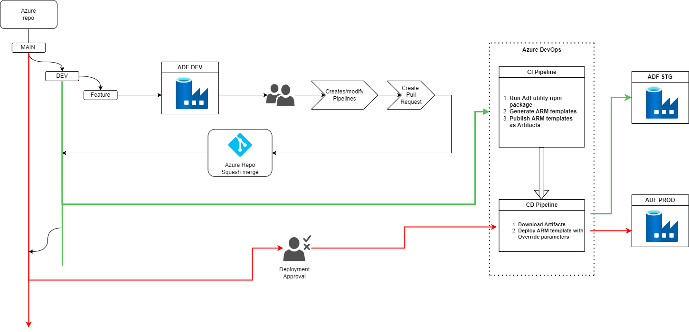
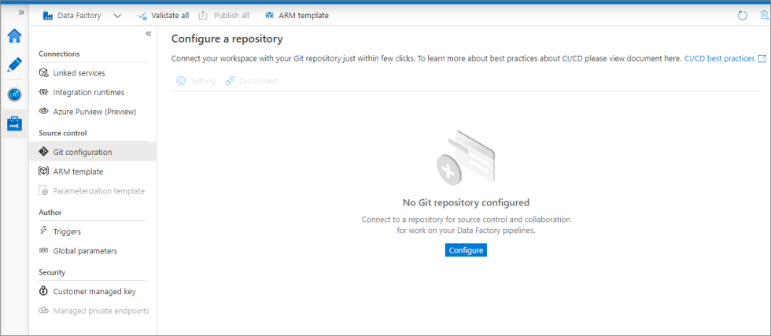

**Continuous integration and delivery in Azure Data Factory**

***Introduction*** : In Azure Data Factory, continuous integration and delivery (CI/CD) means moving Data Factory pipelines from one environment (development, test, production) to another. Azure Data Factory utilizes Azure Resource Manager templates to store the configuration of your various ADF entities (pipelines, datasets, data flows, and so on). There are two suggested methods to promote a data factory to another environment:

1. Automated deployment using Data Factory's integration with Azure Pipelines
2. Manually upload a Resource Manager template using Data Factory UX integration with Azure Resource Manager.

## Source control in Azure Data Factory

ADF generates ARM templates in order to deploy your pipelines. There is only one ADF Publish branch and a collaboration branch as well.

### Here's a step-by-step guide to integrate Source Control with your branching strategy:

1. Setup the Git Repository: Begin by creating a single Git Repository. This repo will accommodate multiple ADFs, all designed for a particular set of pipelines.

2. Branching Structure: Each ADF will have its branch, treated as a collaboration branch. This structure results in different folders being created under the adf_publish branch.
Ensure you maintain separate development branches. This allows features to be developed, tested, and deployed individually before merging.
3. Link Development Branches to Source Control:
Connect only the development branches to source control. This ensures that the code is continuously checked and validated as it’s being developed.
UAT/Production deployments remain unlinked, promoting a clear distinction between development and deployment environments.

4. Deploying Changes:
Use ARM templates generated by ADF for deploying your pipelines. This ensures a consistent deployment process irrespective of the feature being deployed.
5. Final Merging:
Once all testing is done and you're ready to deploy, merge the feature branches with the collaboration branch. Ensure that the final code in the collaboration branch is what gets deployed to production.

## Benefits of Integrating Git with Azure Data Factory
Git integration enriches the Azure Data Factory authoring experience by offering:

### Enhanced Source Control: As data factory tasks become vital: 
Audit and track changes seamlessly.
Easily rollback undesirable changes or bugs.
### Flexible Saves: Unlike direct authoring where every save needs validation, Git integration:

### Permits drafts or partial saves.
Allows for gradual adjustments without validation constraints, ensuring safe publishing only after thorough testing.
### Collaboration & Role-Based Controls: 
With Git Team members can collaborate via code reviews.
Set differentiated permissions; limiting who can edit via Git and who can publish.
### Streamlined CI/CD: 
Git aids in creating a robust continuous delivery process by:
Automating release pipelines on changes to your 'dev' factory.
Allowing customization in Resource Manager template properties, promoting cleaner configuration management.
### Optimized Performance: 
Factories integrated with Git are notably faster, loading up to 10 times quicker than those without, due to efficient resource downloading via Git.

>When a Git repository is set up, direct authoring in the Azure Data Factory UI is disabled. However, changes made through PowerShell or an SDK are directly published to the Data Factory service and don't get reflected in Git.

## Connect to a Git repository

### Configuration using Management hub

Go to the management hub in the ADF UX. Select **Git configuration** in the **Source control** section. If you have no repository connected, click **Configure**.

> When configuring git in the Azure Portal, settings like project name and repo name have to be manually entered instead being part of a dropdown.

### Azure Repos settings

The configuration pane shows the following Azure Repos code repository settings that you must have to apply the CI-CD template:

| Setting | Description | Value |
|:--- |:--- |:--- |
| **Repository Type** | The type of the Azure Repos code repository.  | Azure DevOps Git|
| **Azure Active Directory** | Your Azure AD tenant name. | `<your tenant name>` |
| **Azure Repos Organization** | Your Azure Repos organization name. You can locate your Azure Repos organization name at `https://dev.azure.com/{org_name}` | `<your organization name>` |
| **ProjectName** | Your Azure Repos project name. You can locate your Azure Repos project name at `https://dev.azure.com/{org_name}/{project_name}/`. | `<your Azure Repos project name>` |
| **RepositoryName** | Your Azure Repos code repository name. Azure Repos projects contain Git repositories to manage your source code as your project grows. You can create a new repository or use an existing repository that's already in your project. | `<your Azure Repos code repository name>` |
| **Collaboration branch** | Your Azure Repos collaboration branch that is used for publishing. By default, it's `main`. Change this setting to `development`. | `<your collaboration branch name>` |
| **Publish branch** | The Publish branch is the branch in your repository where publishing related ARM templates are stored and updated. By default, it's `adf_publish`. | `<your publish branch name>` |
| **Root folder** | Your root folder in your Azure Repos collaboration branch. | `your ADF name` |
| **Import existing Data Factory resources to repository** | Specifies whether to import existing data factory resources from the UX **Authoring canvas** into an Azure Repos Git repository. Select the box to import your data factory resources into the associated Git repository in JSON format. This action exports each resource individually (that is, the linked services and datasets are exported into separate JSONs). When this box isn't selected, the existing resources aren't imported. | Selected (default) |
| **Branch to import resource into** | Specifies into which branch the data factory resources (pipelines, datasets, linked services etc.) are imported. You can import resources into one of the following branches: a. Collaboration b. Create new c. Use Existing |  |

> remember to enable the tick in the management hub to include global parameters into ARM template if you have any global parameters declared in your environment

## How to use the Pipeline template

This guide outlines how to set up and use the Azure Data Factory CI/CD pipeline defined in the provided YAML file. The pipeline facilitates the build and deployment of ADF artifacts to specified environments.

### Prerequisites:
#### Azure Data Factory (ADF) Instance: 
Ensure you have an Azure Data Factory instance set up in Azure.
#### Azure DevOps:
The YAML file is designed for Azure DevOps. Make sure you have an Azure DevOps organization and a project.
#### Azure DevOps Agent:
The pipeline uses the ubuntu-latest VM image. Ensure you have permissions to use this image.
#### Node.js:
The build stage uses Node.js, which gets installed during the pipeline run.
#### Azure Subscription:
Ensure you have the required permissions on your Azure subscription to deploy resources.
#### Repository Structure:
Ensure that the ADF code resides in a folder named data-factory in the root of your repository.
Setup:
#### Azure Service Connection:
Set up a service connection in Azure DevOps to your Azure subscription. This is needed for ARM template deployment and optional global parameter updates.
#### GlobalParametersUpdateScript.ps1:
If you've set the updateGlobalParameters flag to true, ensure that you have a PowerShell script named GlobalParametersUpdateScript.ps1 in the root of your repository. This script should handle the logic to update the global parameters in your Data Factory.
#### Using the Pipeline:
Upload YAML File: Add the provided YAML file to your Azure DevOps repository.
1. Create Pipeline:
copy the yaml file code and create a new pipeline
2. Input Parameters:
Fill up the details in parameters.
3. Target Environment: 
Choose between UAT or Prod.
4. Azure Data Factory Name: 
The name of your Data Factory instance.
5. ADF Publish Folder in Git:
Specify the path to the Data Factory code in your repository.
6. Azure Region/Location:
The Azure region where your Data Factory instance is hosted.
7. Azure Resource Group for ADF: 
The resource group containing your Data Factory.
8.  Azure Subscription ID: 
Your Azure subscription ID.
9. Azure RM Connection Name:
The name of the Azure service connection you set up in Azure DevOps.
10. Source Data Factory Name for ARM template:
Name of the source Data Factory when generating ARM template.
11. Destination Data Factory Name for Deployment:
Name of the destination Data Factory for deployment.
12. Update Global Parameters: Toggle this to true if you want to update the global parameters. Otherwise, leave it at the default false.
#### Run Pipeline:
Trigger the pipeline and wait for the build and deployment to complete.

#### Check Deployment: 
Log into the Azure portal and verify the Data Factory deployment in the specified resource group and region.

#### Modifications:
##### Global Parameter Update: 
If you want to handle global parameter updates differently or modify the logic, adjust the (Optional) Update Global Parameters task in the deployment stage.
##### Additional Tasks: 
Insert any additional tasks or steps as needed within the steps section of either the Build or DeployToEnvironment stages.

## Best practices for Git integration

### Permissions

Typically you don't want every team member to have permissions to update the Data Factory. The following permissions settings are recommended:

*   All team members should have read permissions to the Data Factory.
*   Only a select set of people should be allowed to publish to the Data Factory. To do so, they must have the **Data Factory contributor** role on the **Resource Group** that contains the Data Factory.

It's recommended to not allow direct check-ins to the collaboration branch. This restriction can help prevent bugs as every check-in will go through a pull request review process.

### Using passwords from Azure Key Vault

It's recommended to use Azure Key Vault to store any connection strings or passwords or managed identity authentication for Data Factory Linked Services. For security reasons, data factory doesn't store secrets in Git. Any changes to Linked Services containing secrets such as passwords are published immediately to the Azure Data Factory service.

Using Key Vault or MSI authentication also makes continuous integration and deployment easier as you won't have to provide these secrets during Resource Manager template deployment.

