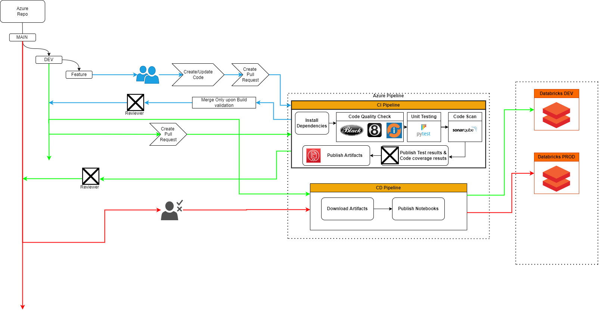

## CI/CD for Databricks Notebook Deployment using Azure DevOps

This document provides a detailed guide on setting up and implementing a CI/CD pipeline for deploying Databricks notebooks using Azure DevOps.

### Overview

A well-defined CI/CD pipeline for Azure Databricks aids in streamlining the code integration and deployment process. While the pipeline configuration may differ based on specific project needs, a typical pipeline encompasses the following stages:

### Continuous Integration:

#### 1. **Code**:
   - **Development**: Write your code and associated unit tests either directly within an Azure Databricks notebook or through an external Integrated Development Environment (IDE).
   - **Testing**: Before committing any changes, run your tests manually to ensure that the code behaves as expected.
   - **Commit**: Once satisfied with the changes and test outcomes, commit the code and associated tests to a feature git branch.

#### 2. **Build**:
   - **Collection**: Gather all the newly created or modified code and tests.
   - **Automated Testing**: Implement automated tests to validate the functionality and robustness of the code.
   - **Compilation**: Construct libraries and compile non-notebook Apache Spark code, if any.

#### 3. **Release**:
   - Generate an artifact from the build process, ready for deployment.

### Continuous Delivery:

#### 4. **Deploy**:
   - **Notebooks**: Deploy the Databricks notebooks to the target workspace.
   - **Libraries**: If there are any custom libraries or dependencies, deploy them alongside the notebooks.

### Developing and Committing Code:

One of the foundational steps in crafting a CI/CD pipeline is determining a commit and branching strategy. This strategy ensures that the integration of new or modified code doesn't negatively impact the production environment. It's essential to select a version control system to manage and promote your code. Azure Databricks provides integrations with several Git providers, allowing users to commit notebooks and code directly to a Git repository.

If you're using a version control system not directly supported by Azure Databricks, or if you require a more granular control over the commit process, you can leverage the Databricks Command Line Interface (CLI) to export notebooks and then commit them from your local setup. Here's a step-by-step guide for this process:

1. **Branching**: Check out the desired feature branch on your local machine.
2. **Sync**: Pull the latest changes from the remote branch to ensure you're working with the most recent version of the code.
3. **Export**: Utilize the Databricks CLI, specifically the workspace commands, to export notebooks from your Azure Databricks workspace.
4. **Commit Prompt**: Present the user with an option to provide a commit message. If none is provided, resort to a default message.
5. **Local Commit**: Commit the exported code and notebooks to the local feature branch.
6. **Push**: Push the changes to the corresponding remote branch, making it available for others and triggering any associated CI processes.

By adhering to this structured approach, teams can ensure that their Azure Databricks projects are developed, tested, and deployed in a consistent and efficient manner.

### Pre-requisites:
- An Azure DevOps Organization and Project should be properly set up and configured.
- A Git Repository should already be established in the Repos section of Azure DevOps.

### Databricks CI/CD with Azure DevOps:

#### 1. **Integrating Azure DevOps Git with Databricks**:
   - Navigate to Azure Databricks -> Settings -> User Settings.
   - Under "User Settings", locate "Git Integration". From the "Git provider" dropdown, select "Azure DevOps Services".
   - For authentication, you can choose between Azure Active Directory or a personal access token. Azure Active Directory is recommended due to its integration across the organization.
   - Save the changes.
   - Navigate to the "Repos" section and click on "Add Repo" to link the DevOps Git repo to your Azure AD login.

#### 2. **Branching and Pull Requests**:
   - You can choose your current branch, typically the "master" branch unless other feature branches have been created. It's possible to create a feature branch from the master branch for development.
   - After development, navigate to Azure DevOps -> Repos -> Branches to create a pull request, merging your feature branch into the master branch.
   - Once merged, the feature branch can be deleted if desired.

#### 3. **Setting up Continuous Integration (CI) for Databricks**:
   - In Azure DevOps, navigate to "Pipelines" and create a new pipeline using the Classic editor.
   - Select the repository and master branch to collect artifacts.
   - Opt for an "Empty Job" during template selection.
   - Add a "Publish Artifact: Notebooks" task in the pipeline to build artifacts from the Databricks notebooks. Set the appropriate path to publish and artifact name from the DevOps Git repository.

#### 4. **Setting up Continuous Deployment (CD)**:
   - In the Pipelines section, select "Releases" and then "New Release Pipeline".
   - Choose the artifacts that were built during the CI process.
   - Add a "Development Job" consisting of two tasks: "Configure Databricks CLI" and "Deploy Notebooks to Workspace".
      - Provide the target Databricks workspace URL and access token.
      - Define the target Databricks notebooks folder and workspace folder for artifact deployment.
   - For production deployment, repeat the above step, linking it to the Development Job.
   - Set up a continuous deployment trigger for the release pipeline, specifying the branch to monitor (e.g., the "master" branch).
   - Configure pre-deployment conditions for the Production Job by adding approvers.

#### Setup:

1. **Fork or Clone the Repository**:
   - Begin by forking or cloning the repository that contains the pipeline files.

2. **Configure Azure DevOps Secrets**:
   - Navigate to the Azure DevOps dashboard.
   - Select the appropriate project and repository.
   - Go to `Pipelines` > `Library` and add the necessary secrets. These might include:
     - Databricks host URL
     - Databricks token
     - Sonar host URL
     - Sonar token
   - Make sure to reference these secrets in your pipeline YAML files using the `${{ secrets.<secret_name> }}` syntax.

3. **Setup the CI/CD Pipelines**:
   - Navigate to `Pipelines` in Azure DevOps.
   - Create a new pipeline and select the respective YAML file (`deployment-pipeline-dev.yml`, `deployment-pipeline-prod.yml`, or `test-pipeline.yaml`).
   - Follow the prompts to save and run the pipeline.

4. **Modify Parameters as Needed**:
   - Each pipeline file contains a `parameters` section that allows for configuration. Modify these parameters as per your project's needs. For example, you might want to change the default Databricks notebook path or specify a different Sonar project key.

## Using the Azure Databricks CI/CD Pipeline Template

This section provides a step-by-step guide on how to utilize the provided Azure Databricks CI/CD pipeline template in your projects.

### Pre-requisites:

1. **Azure DevOps Account**: Ensure you have an active Azure DevOps account with appropriate permissions.
2. **Databricks Workspace**: An operational Databricks workspace where your notebooks will be deployed.
3. **Version Control**: The code should be hosted in a Git repository, ideally one supported by Azure DevOps.

### Step-by-Step Guide:

#### 1. **Clone or Fork the Template Repository**:

   - Start by cloning or forking the repository containing the CI/CD pipeline template.

#### 2. **Set Up Secrets in Azure DevOps**:

   - Navigate to your Azure DevOps dashboard.
   - Select your project and navigate to `Pipelines` -> `Library`.
   - Here, add the necessary secrets such as the Databricks host URL, token, Sonar host URL, and token.

#### 3. **Modify the Template Parameters**:

   - Open the provided pipeline YAML files (`deployment-pipeline-dev.yml`, `deployment-pipeline-prod.yml`, `test-pipeline.yaml`).
   - Adjust the `parameters` section to match your project's needs. This might include setting paths, branch names, or any other specific configurations.

#### 4. **Set Up the CI/CD Pipelines**:

   - In Azure DevOps, navigate to `Pipelines`.
   - Create a new pipeline and select the YAML file you wish to use.
   - Follow the on-screen instructions to save and run the pipeline.

### **Development Workflow**:

   - **Feature Branch Development**: Developers should create feature branches for new features or bug fixes. Once the development is complete and local tests are successful, they can commit and push the changes.
   - **Pull Request to `develop` Branch**: Create a pull request to merge the feature branch into the `develop` branch. The `test-pipeline.yaml` will automatically run, ensuring the code quality and functionality.
   - **Merging to `develop`**: Once tests pass and a code review is complete, the code can be merged into the `develop` branch. This action will trigger the `deployment-pipeline-dev.yml`, deploying the notebooks to the development environment.
   - **Production Deployment**: When the team is ready to release the changes to production, they can create a pull request from the `develop` branch to the `main` branch. Upon merging, the `deployment-pipeline-prod.yml` will be triggered, deploying the notebooks to the production environment.

#### 6. **Monitoring & Feedback**:

   - Continuously monitor the pipelines for any failures or issues.
   - Ensure that feedback from the pipelines, especially failed tests or deployments, is communicated to the development team promptly.

#### Conclusion:
By following this guide, you should have a seamless CI/CD pipeline for your Databricks notebooks using Azure DevOps. Ensure you regularly monitor the pipeline runs and address any issues or failures promptly for smooth deployments.

 